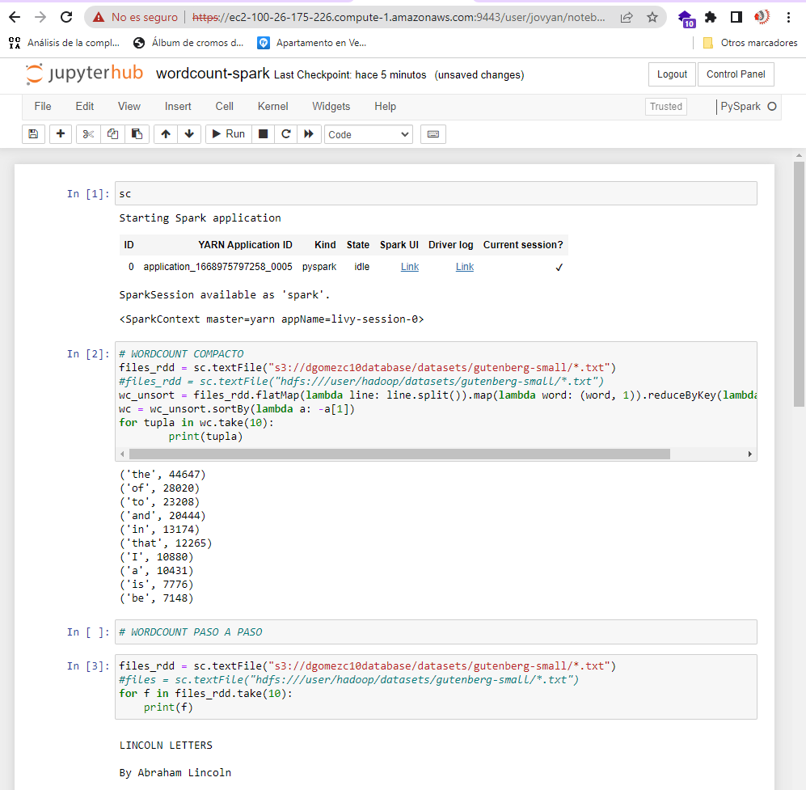

# ST0263 Tópicos Especiales en Telematica, 2022-2

__Estudiante:__

 David Gómez Correa, dgomezc10@eafit.edu.co  

__Profesor:__

 Edwin Nelson Montoya Munera, emontoya@eafit.edu.co

---

# Laboratorio #6 - BIG DATA 
__Pyspark__

- [Laboratorio 6](#laboratorio-6---big-data)
  - [Descripción de la actividad](#1-breve-descripción-de-la-actividad)
  - [información general](#2-información-general-de-diseño-de-alto-nivel-arquitectura-patrones-mejores-prácticas-utilizadas)
  - [Descripcion ambiente desarrollo y tecnico](#3-descripción-del-ambiente-de-desarrollo-y-técnico-lenguaje-de-programación-librerias-paquetes-etc-con-sus-numeros-de-versiones)
  - [Referencias](#4-referencias)

--- 

  
## 1. Breve descripción de la actividad

### 1.1. Que aspectos cumplió o desarrolló de la actividad propuesta por el profesor (requerimientos funcionales y no funcionales)
Se realiza la reación de un clúster EMR donde se activa el servicio HUE., para posteriormente utilizar los servicios de HIVE y Spark para la gestion de los daots. Igualmente, se hace uso de pyspark para ejecutar el wordcount de forma interactiva de los datos previamente cargados de HDFS y S3. Ademas, se ejecuta los wordcount en JupyterHub Notebooks EMR con datos en S3. Paara finalizar, se ejecuta y entiende el notebook de Data_processing_using_PySpark.ipynb.

---

## 2. información general de diseño de alto nivel, arquitectura, patrones, mejores prácticas utilizadas.
Se hace uso de un servidor DHFS y de un AWS Bucket 

---

## 3. Descripción del ambiente de desarrollo y técnico: lenguaje de programación, librerias, paquetes, etc, con sus numeros de versiones.

### Guía de conexión al cluster en Amazon EMR y cargar los datasets al hdfs:

1. Carga de los datasets com el comando de scp
    ```
    scp -i cluster.pem -r D:/Telematica/st0263/Laboratorios/Laboratorio_6 hadoop@ec2-100-26-175-226.compute-1.amazonaws.com:/home/hadoop/
    ```
    
2. Realizamos la copia de los archivos al dhfs.
    ```
    hdfs dfs -copyFromLocal /home/haddop/Laboratorio_6/datasets/* /user/hadoop/datasets
    ```
    
---
### Parte 1:
__Ejecutar el wordcount por linea de comando 'pyspark' Interactivo en EMR con datos en HDFS vía ssh en el nodo master.__

1. Se ejecuta la siguiente linea de comandos
    ```
    $ pyspark
    >>> files_rdd = sc.textFile("hdfs:///user/hadoop/datasets/gutenberg-small/*.txt")
    >>> wc_unsort = files_rdd.flatMap(lambda line: line.split()).map(lambda word: (word, 1)).reduceByKey(lambda a, b: a + b)
    >>> wc = wc_unsort.sortBy(lambda a: -a[1])
    >>> for tupla in wc.take(10):
    >>>     print(tupla)
    >>> wc.saveAsTextFile("hdfs:///tmp/wcout1")
    ```
    
__Ejecutar el wordcount por linea de comando 'pyspark' en EMR con datos en S3__

1. Se ejecuta la siguiente linea de cmoandos
     ```
    $ pyspark
    >>> files_rdd = sc.textFile("s3://notebooksochoac/datasets/gutenberg-small/*.txt")
    >>> wc_unsort = files_rdd.flatMap(lambda line: line.split()).map(lambda word: (word, 1)).reduceByKey(lambda a, b: a + b)
    >>> wc = wc_unsort.sortBy(lambda a: -a[1])
    >>> for tupla in wc.take(10):
    >>>     print(tupla)
    >>> 
    >>> wc.saveAsTextFile("hdfs:///tmp/wcout3")
    ```
    
__Ejecutar el wordcount en JupyterHub Notebooks EMR con datos en S3__
1. Cargamos el notebook y lo ejecutamos.
    

2. Revisamos que el archivo se haya guardado correctamente
    
    
---
### Parte 2:
__Replique, ejecute y ENTIENDA el notebook: Data_processing_using_PySpark.ipynb con los datos respectivos.__

__Ejecutamos los siguientes comandos:__ 

- Listas columnas
- Número de columnas
- Número de registros
- Forma del dataset


---

- Imprimir esquema
- Seleccionar 2 columnas (age and mobile) y 5 registros
- Información del dataframe


---

- Se agrega columna con edad 10 años despues.
- Se pasa la edad a double.


- Filtra los registros cuyo 'mobile' sea 'Vivo'.
- Filtra los registros cuyo 'mobile' sea 'Vivo' y muestra las columnas age, ratings, mobile.
- Filtra los registros cuyo 'mobile' sea Vivo y experiencia mayor a 10.


---

- Filtra los valores de una columna sin repetir.
- Cuenta los valores de una columna sin repetir.
- Agrupa registros cuyo valor coincida respecto a una columna, luego cuenta las coincidencias.
- Cuenta las coincidencias de un valor de una columna y los agrupa de mayor a menor.


---

- Agrupa los valores de una columna y muestra el promedio en que aparece el valor para cada columna.
- Agrupa los valores de una columna y muestra la suma en que aparece el valor para cada columna.
- Agrupa los valores de una columna y muestra el maximo en que aparece el valor para cada columna.
- Agrupa los valores de una columna y muestra el minimo en que aparece el valor para cada columna.


---

- Agrupa los valores de una columna y muestra la agregación.
- Función para catalogar las marcas en 'High price', 'Mid Price' y 'Low Price'
- Utilizar funcion lambda para determinar si la persona es joven o adulta.


   

---

- Guardar un archivo csv


---

# 4. Referencias
[Este es el link al repositorio de la materia donde me base para realizar el lab6.](https://github.com/st0263eafit/st0263-2022-2/tree/main/bigdata)

#### versión README.md -> 1.0 (2022-agosto)
