# ST0263 Tópicos Especiales en Telematica, 2022-2

__Estudiante:__

 David Gómez Correa, dgomezc10@eafit.edu.co  

__Profesor:__

 Edwin Nelson Montoya Munera, emontoya@eafit.edu.co

---

# Proyecto#3 - BIG DATA 
__Spark con Notebooks y PySpark__

- [Proyecto 3](#proyecto3---big-data)
  - [Descripción de la actividad](#1-breve-descripción-de-la-actividad)
  - [información general](#2-información-general-de-diseño-de-alto-nivel-arquitectura-patrones-mejores-prácticas-utilizadas)
  - [Descripcion ambiente desarrollo y tecnico](#3-descripción-del-ambiente-de-desarrollo-y-técnico-lenguaje-de-programación-librerias-paquetes-etc-con-sus-numeros-de-versiones)
  - [Referencias](#4-referencias)

--- 

## 1. **Breve descripción de la actividad**

### 1.1. __Que aspectos cumplió o desarrolló de la actividad propuesta por el profesor (requerimientos funcionales y no funcionales)__
Se realiza la carga de los datasets al bucket s3 __dgomezc10database__ y al google Drive. Porstriomente, se realiza dos archivos de Pyspark, para realizar una analisis a los datos encontrados. Primero, se realiza un analisis exploratorio de los datagrame que cargamos. Una vez realizado dicho analisis, se procede a respoder algunas preguntas de negocio sobre el conjunto de datos de covid. para finalizar, se realiza la carga de los resultados del proyecto al bucket S3.

---

## 2. **información general de diseño de alto nivel, arquitectura, patrones, mejores prácticas utilizadas.**

Se hace uso de google Drive y de Amazon S3 para la carga de los set de datos. Para el analisis de los datos se hace uso de Jupyter y de Pyspark.

---

## **3. Descripción del ambiente de desarrollo y técnico: lenguaje de programación, librerias, paquetes, etc, con sus numeros de versiones.**

__Archivos de Jupyter Notebook:__
- [Archivo de Drive](jupyter/Drive_David_Gomez_C.ipynb)
- [Archivo de AWS](jupyter/Aws_David_Gomez_Correa.ipynb)

### __2.1 Analisis exploratorio del dataframe donde cargamos los datos__

1. Configuracion de Pyspark para Drive.

    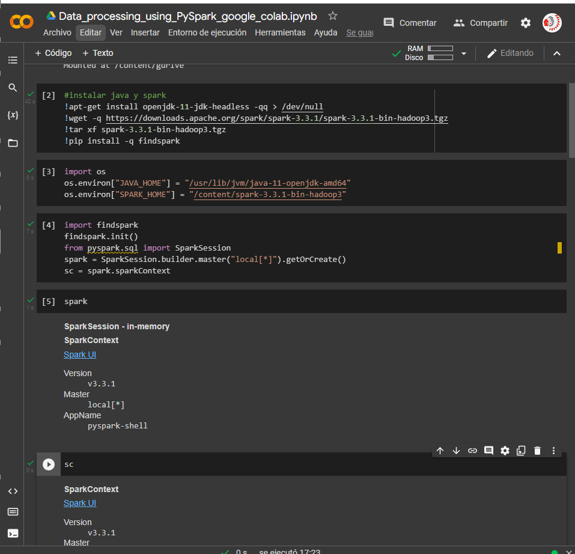

---

2. Configuracion de Pyspark para AWS.

    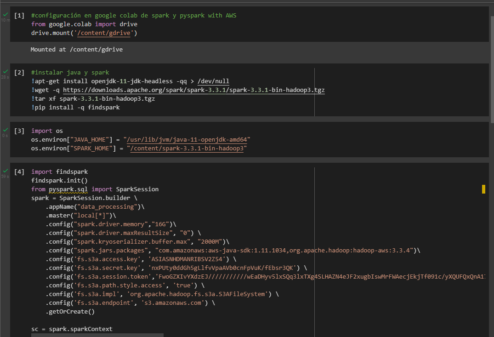
    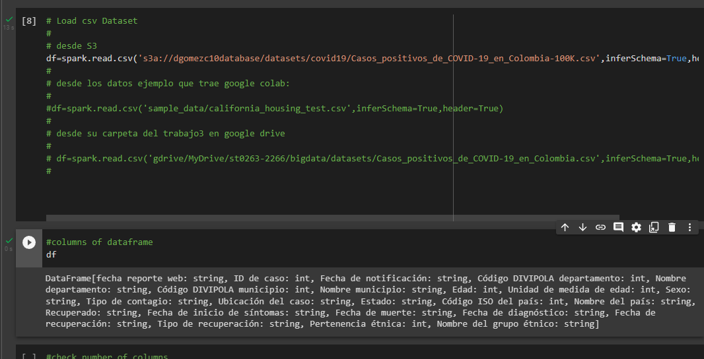

---

3. Consulta de columnas.

    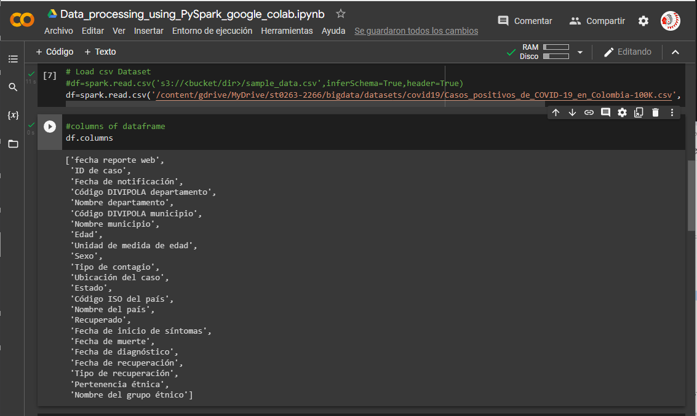

---

4. Print Schema.

    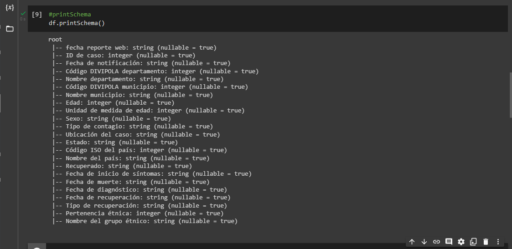

---

5. Seleccionar algunas columnas.

    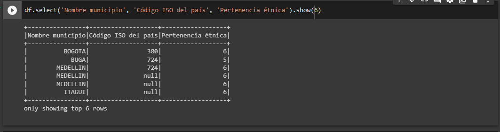

---

6. Renombrar columnas.  

    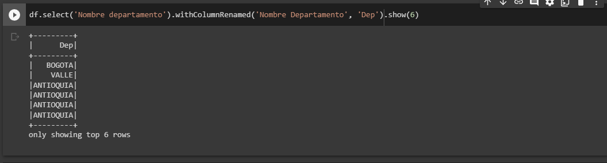

---

7. Agregar una columna.

    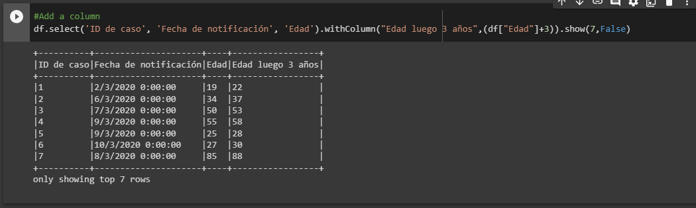

---

8. Eliminar una columna.

    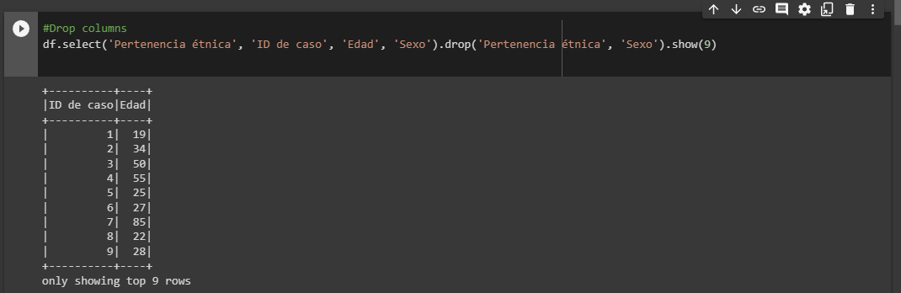

---

9. Filtrar datos.

    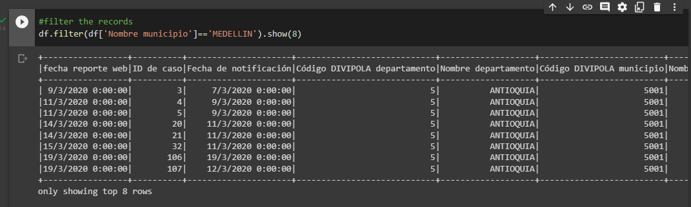

---

10. Ejecucion de funcion UDF o lambda sobre una columna.

    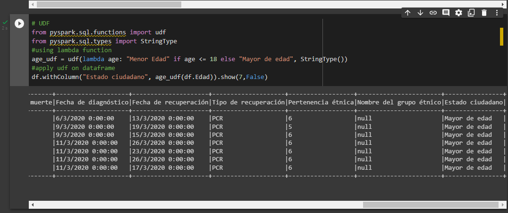

---

### __3 Contestar las sigueintes preguntas sobre los datos de covid__

1. Los 10 departamentos con más casos de covid en Colombia ordenados de mayor a menor.
    1. Dataframe

    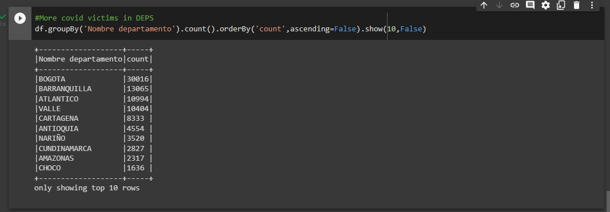

    2. PysparkSql

    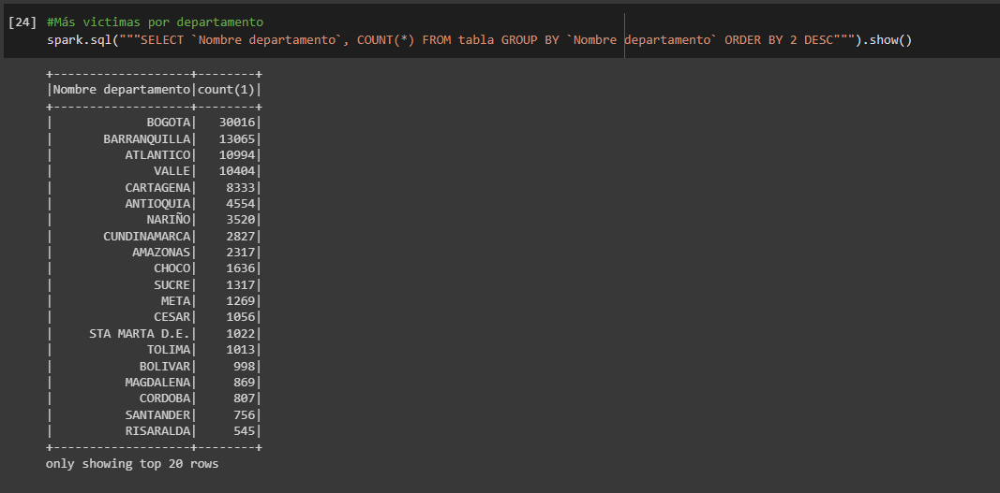

---    

2. Las 10 ciudades con más casos de covid en Colombia ordenados de mayor a menor.
    1. Dataframe

    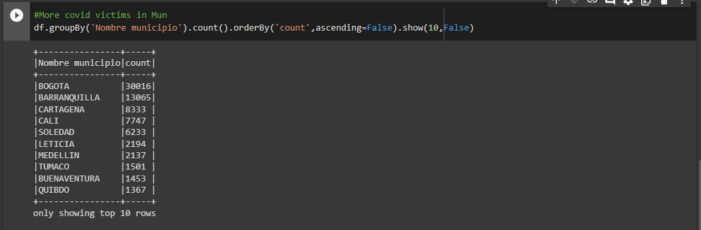

    2. PysparkSql

    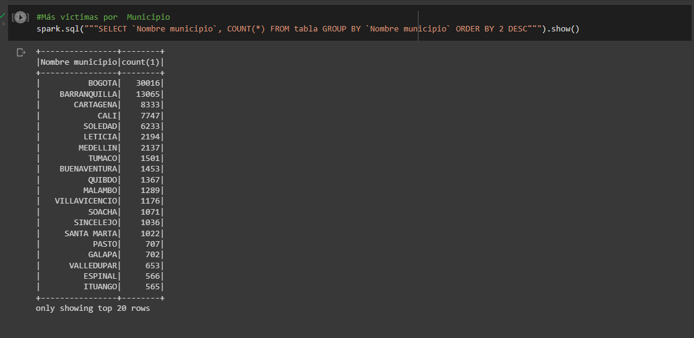

---

3. Los 10 días con más casos de covid en Colombia ordenados de mayor a menor.
    1. Dataframe

    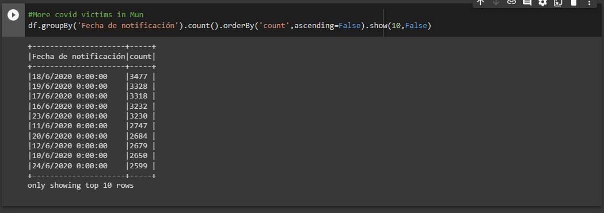

    2. PysparkSql

    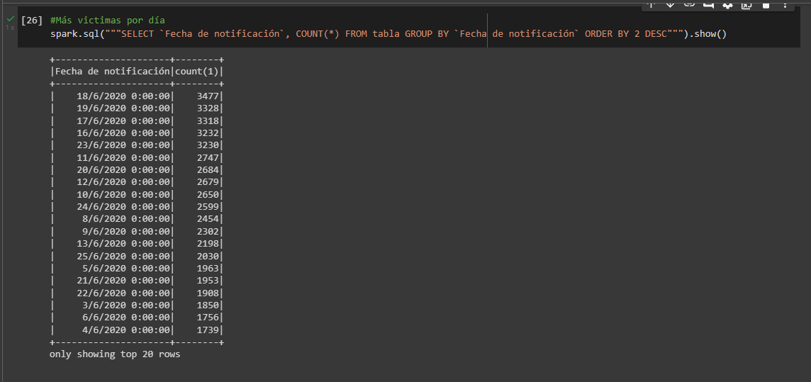

---

4. Distribución de casos por edades de covid en Colombia.
    1. Dataframe

    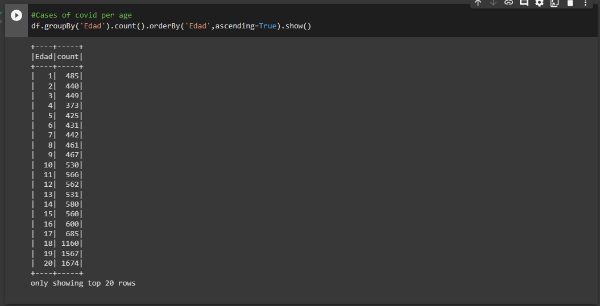

    2. PysparkSql

    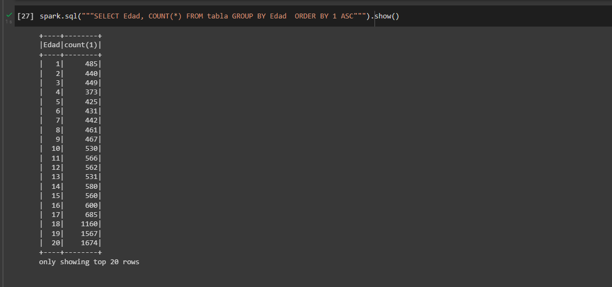

---

5. Distribución de casos por Sexo 
    1. Dataframe

    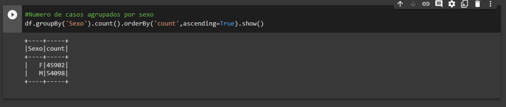

    2. PysparkSql
    
    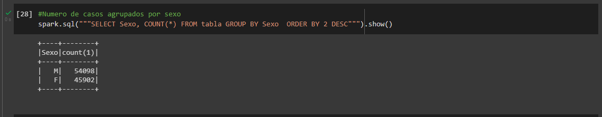

---

### __4 Salvar los datos del numeral 3 en el bucket publico__

[Link del bucket publico dgomezc10](https://dgomezc10database.s3.amazonaws.com/df_csv/)

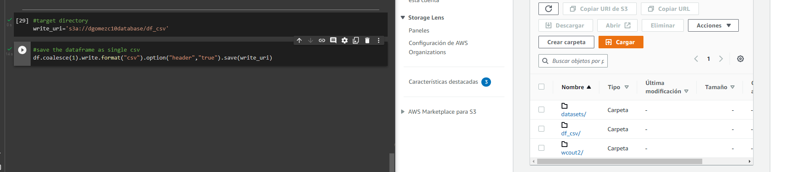 
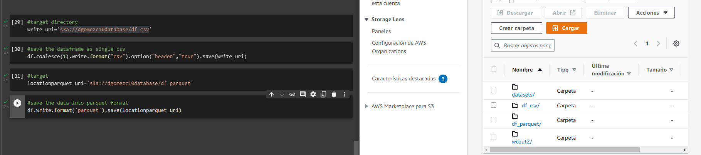 

---

## 4. Referencias
[Link del github de la materia.](https://github.com/st0263eafit/st0263-2022-2/tree/main/bigdata)

#### versión README.md -> 1.0 (2022-agosto)
